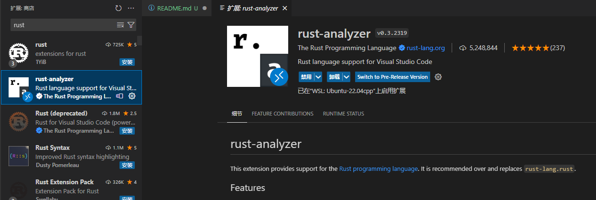
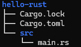
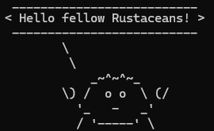

# rust_start
参考[rust-lang.org](https://rust-lang.org/learn/get-started/)

## 说明
安装rust编程环境

## 开始！

### 1. 安装rust
```bash
curl --proto '=https' --tlsv1.2 -sSf https://sh.rustup.rs | sh
```
一路回车即可

### 2. vscode插件安装


### 3. 检查是否安装好rust
```bash
rustc --version
cargo --version
```
输出
```bash
rustc 1.90.0 (1159e78c4 2025-09-14)
cargo 1.90.0 (840b83a10 2025-07-30)
```
(目前版本使用的是1.90.0)

可以使用rustup update来更新rust
```bash
rustup update
```

## 开始一个project

### 1. 使用cargo new来创建一个项目
```bash
cargo new hello-rust
```
会生成如下文件



### 2. 使用cargo run运行代码
```bash
cd hello-rust
cargo run
```

### 3. 尝试添加一些依赖项
在rust中，[crates](https://crates.io/)是一个libraries管理网站

#### 3.1 手动修改来添加依赖项
在[Cargo.toml](hello-rust/Cargo.toml)中加入一个crate - ferris-says
```toml
[dependencies]
ferris-says = "0.3.2"
```
cargo add ferris-says
#### 3.2 命令行添加（推荐，因为crate可能会更新）
```bash
cargo add ferris-says
```

#### 3.3 执行cargo build
```bash
cargo build
```
这样Cargo会安装这些依赖项

### 4.一个小的rust应用
在[main.rs](hello-rust/src/main.rs)修改
```rust
use ferris_says::say; // from the previous step
use std::io::{stdout, BufWriter};

fn main() {
    let stdout = stdout();
    let message = String::from("Hello fellow Rustaceans!");
    let width = message.chars().count();

    let mut writer = BufWriter::new(stdout.lock());
    say(&message, width, &mut writer).unwrap();
}
```
保存后，执行
```bash
cargo run
```
会得到

